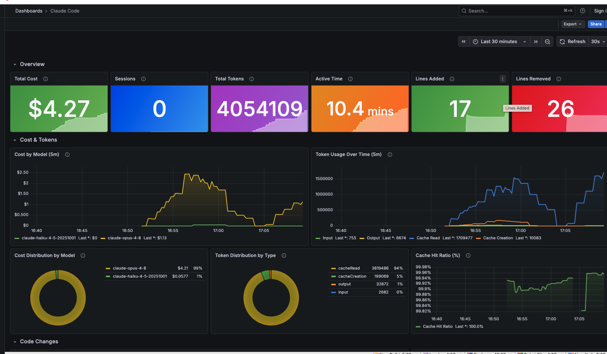
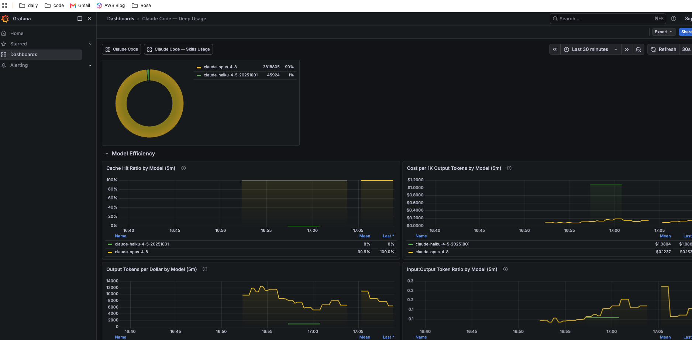
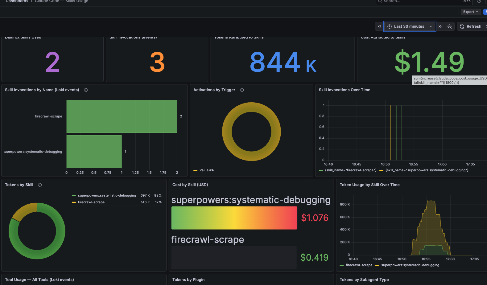

# Claude Code — Local Observability Stack (Docker)

One command spins up a full local observability stack for [Claude Code](https://claude.com/claude-code) — **Prometheus + Grafana + Loki + OTEL Collector** — with pre-built dashboards for cost, tokens, sessions, tool usage, and skills usage. Everything runs in Docker; nothing touches your system package manager.

Built and tested on **macOS (Apple Silicon) + Docker Desktop**.

## Demo

https://github.com/user-attachments/assets/0cd0e2a5-0f8a-4f41-a313-0322ba55fda9

## Screenshots

**Claude Code** — cost, tokens, sessions, active time, code churn:



**Model Usage** — per-model cost, token, and efficiency breakdown:



**Skills Usage** — skill/tool invocation events from Loki:



## Quickstart

```bash
git clone https://github.com/neeltom92/claude-code-observability.git
cd claude-code-observability
make up
```

That single command:

1. **Preflights** — checks Docker is installed and running, `docker compose` is available, and the host ports are free. If Docker is missing it prints install guidance and stops.
2. **Patches Claude Code** — adds the OTEL env vars to `~/.claude/settings.json` so Claude Code exports telemetry to the local collector.
3. **Starts the stack** — `docker compose up -d` (4 containers).
4. **Verifies health** — polls every service and reports per-service status.
5. **Prints the URLs.**

Then **restart Claude Code** so the new env vars take effect, and open <http://localhost:3000>.

## Is it running? (no install needed)

```bash
make check
```

Probes Grafana, OTEL collector, Loki, and Prometheus on their host ports and reports `✓`/`✗` per service — without starting anything. Use it to confirm the stack is healthy or diagnose what's down.

## Targets

| Target | What it does |
|---|---|
| `make up` | Preflight → patch Claude settings → start → verify → print URLs |
| `make check` | Health-check each service without starting the stack |
| `make status` | `docker compose ps` + one-shot health report |
| `make logs` | Tail logs from all services |
| `make restart` | Restart all services |
| `make down` | Stop the stack (keeps data volumes) |
| `make clean` | Stop, **delete data volumes**, and revert the Claude settings patch |
| `make patch` / `make unpatch` | Apply / remove the Claude OTEL settings patch only |
| `make config` | Validate + render the compose config |
| `make pull` | Pull the pinned images |

Run `make` (or `make help`) for the full list.

## Architecture

```
Claude Code (host) --OTLP/HTTP--> localhost:4318 --> otel-collector
   otel-collector --prometheus exporter--> :8889  (scraped by Prometheus)
   otel-collector --OTLP logs--> loki:3100/otlp
   Grafana --query--> prometheus:9090  and  loki:3100
```

| Service | Host port | Purpose |
|---|---|---|
| OTEL Collector | 4317 (gRPC), 4318 (HTTP), 8889 (prom) | Receives Claude Code telemetry; exports metrics to Prometheus, logs to Loki |
| Prometheus | 9090 | Stores metrics (30d retention) |
| Loki | 3100 | Stores per-invocation skill/tool events (30d retention) |
| Grafana | 3000 | Dashboards (anonymous Viewer; `admin`/`admin` to edit) |

All ports bind to `127.0.0.1` only — the stack is not exposed beyond your machine.

## Dashboards

- **Claude Code** — cost, tokens, sessions, code churn, tool decisions: <http://localhost:3000/d/claude-code-metrics>
- **Model Usage** — per-model cost/token deep dive: <http://localhost:3000/d/claude-code-deep-usage>
- **Skills Usage** — skill/tool invocation events from Loki: <http://localhost:3000/d/claude-code-skills>

## Privacy note

`OTEL_LOG_TOOL_DETAILS=1` (set by the settings patch) stores tool/skill names and input args — **including Bash command lines** — in your local Loki instance. This is loopback-only and never leaves your machine. Remove that key from `~/.claude/settings.json` (or run `make unpatch`) to disable event detail.

## Uninstall

```bash
make clean   # stops containers, deletes volumes, reverts Claude settings
```

Then restart Claude Code.

## Notes

- Image tags are pinned to known-good versions in `docker-compose.yml`. For stricter supply-chain hardening, replace each tag with its multi-arch digest (`image@sha256:...`).
- This repo is self-contained — clone it anywhere and `make up`.
- `make up` writes OTEL env vars into `~/.claude/settings.json`. A timestamped backup (`settings.json.bak.<ts>`) is made before any change. Review `scripts/patch-claude-settings.py` first; `make unpatch` reverts them.

## Contributing

Issues and PRs welcome. Keep it boring and self-contained — no extra runtime dependencies beyond Docker.

## License

[Apache-2.0](LICENSE) © Neel Thomas
